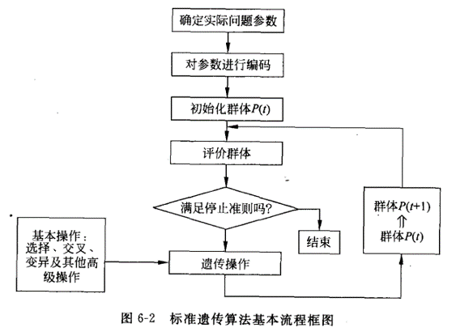
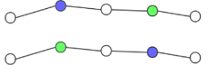
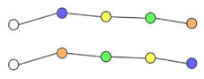
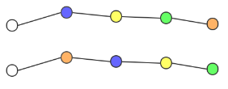
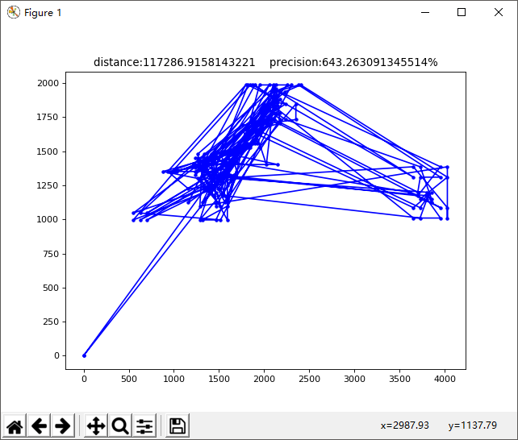
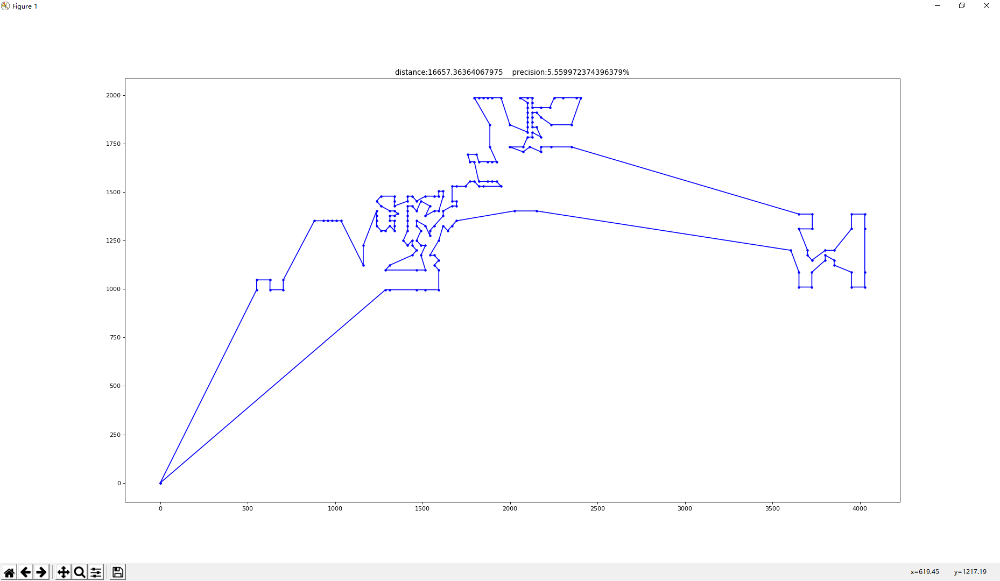

# 遗传算法求解 TSP 问题

## TSP 问题

- TSP(Traveling salesman problem) 问题，即旅行推销员问题，指给定一系列城市和每对城市之间的距离，求解访问每一座城市一次并回到起始城市的最短回路。
- 是组合优化中的一个 NP 困难问题。

数据来源：[TSPLIB](https://comopt.ifi.uni-heidelberg.de/software/TSPLIB95/tsp/)

最优解：[Optimal solutions for symmetric TSPs](https://comopt.ifi.uni-heidelberg.de/software/TSPLIB95/STSP.html)

TSPLIB 是一个从各种来源和各种类型中产生的 TSP 及其相关问题的采样实例库。

## 遗传算法

遗传算法（Genetic Algorithm）是模拟达尔文生物进化论的自然选择和遗传学机理的生物进化过程的计算模型，是一种通过模拟自然进化过程搜索最优解的方法。

遗传算法是从代表问题可能潜在的解集的一个种群（population）开始的，而一个种群则由经过基因（gene）编码的一定数目的个体（individual）组成。

### 算法步骤

## 设计 GA 算法，求解 TSP 问题

### 参数编码

TSP 问题是纯有序问题，因此采用有序编码，用城市序号串表示 TSP 路径

例如：城市序号数组 {1, 3, 5, 7, 9, 2, 4, 6, 8, 10} 表示按 "1 -> 3 -> 5 -> 7 -> 9 -> 2 -> 4 -> 6 -> 8 -> 10 -> 1" 依次访问各个城市

### 初始化群体

随机生成 100 个 TSP 路径作为初始群体

### 适应度函数设计

直接将 TSP 路径总长度作为适应值的衡量，路径越短，具有越高的评价

### 遗传操作

选择：采用线性排名选择，将群体成员按路径长度从长到短依次排列，然后根据一个线性函数来分配选择概率。

交叉：每次交叉操作进行多个单点交叉。交叉点随机生成。有两种单点交叉方式，一是两个父代的相同位置，二是一个父代的位置n与另一个父代的位置n+1的城市互换，每次交叉操作随机选择一种。

变异：引入多种局部搜索操作替换通常遗传算法的变异操作，每次变异随机选择一种局部搜索操作

 1. 交换两个城市在路径上的位置
    
    

 2. 两个城市之间的路径进行逆序

    

 3. 一个城市移动到另一个城市前面

    

## 总结

### 运行结果

求得的解不超过最优值的 8%，一次运行情况如图（误差 5%）

初始解

求得的最优解

### 结论

 - 和模拟退火算法（采用相同的局部搜索操作）进行比较

遗传算法是从问题解的串集开始搜索，而模拟退火算法是从单个解开始。遗传算法同时处理群体中的多个个体，即对搜索空间中多个解进行评估，覆盖面大，利于全局择优，但算法收敛速度比较慢；而模拟退火算法是从单个初始值迭代求最优解的，虽有改进，但仍可能陷入局部最优解，相比与遗传算法，收敛速度快。

 - 得出设计高效遗传算法的一些经验，并比较单点搜索和多点搜索的优缺点：

设计高效遗传算法的经验：
1. 采用适当的遗传编码和适应值函数
2. 设计较好的交叉操作、变异操作
3. 选取恰当的控制参数（位串长度、群体规模、交叉概率、变异概率）

比较单点搜索和多点搜索的优缺点：
 - 单点搜索：收敛速度快；容易陷入局部最优解。
 - 多点搜索：利于全局择优；收敛速度慢。
