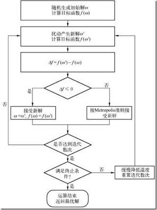
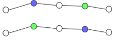
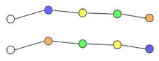
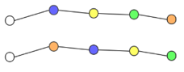
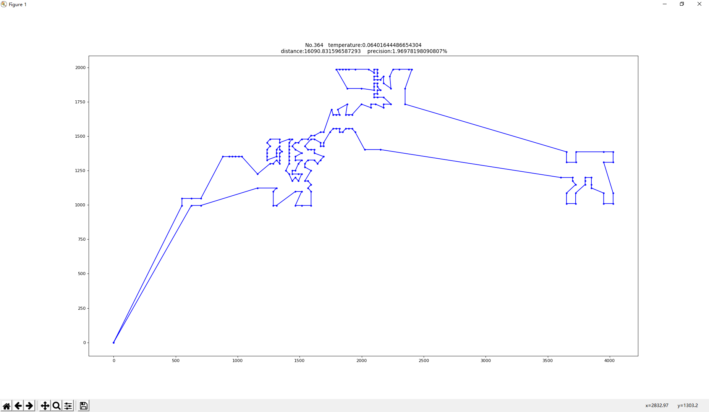

# 模拟退火算法求解 TSP 问题

## TSP 问题

- TSP(Traveling salesman problem) 问题，即旅行推销员问题，指给定一系列城市和每对城市之间的距离，求解访问每一座城市一次并回到起始城市的最短回路。
- 是组合优化中的一个 NP 困难问题。

数据来源：[TSPLIB](https://comopt.ifi.uni-heidelberg.de/software/TSPLIB95/tsp/)

最优解：[Optimal solutions for symmetric TSPs](https://comopt.ifi.uni-heidelberg.de/software/TSPLIB95/STSP.html)

TSPLIB 是一个从各种来源和各种类型中产生的 TSP 及其相关问题的采样实例库。

## 模拟退火算法

模拟退火法（Simulated Annealing）是克服爬山法缺点（陷入局部最优）的有效方法。退火是指冶金专家为了达到某些特种晶体结构重复将金属加热或冷却的过程，该过程的控制参数为温度T。模拟退火法的基本思想是，在系统朝着能量减小的趋势这样一个变化过程中，偶尔允许系统跳到能量较高的状态，以避开局部极小点，最终稳定到全局最小点。

模拟退火算法求得的解与初始解状态S（是算法迭代的起点）无关；模拟退火算法具有渐近收敛性，已在理论上被证明是一种以概率1收敛于全局最优解的全局优化算法；模拟退火算法具有并行性。

### 算法步骤

#### 初始化

生成一个可行的解作为当前解输入迭代过程，并定义一个足够大的数值作为初始温度。

#### 迭代过程

 1. 产生新解（各种邻域操作）
 2. 计算能量变化ΔE（目标函数差）
 3. 判断是否接受新解，最常用的接受准则是Metropolis准则：若ΔE<0则接受S′作为新的当前解S，否则以概率exp（-ΔE/T）接受S′作为新的当前解S。

 #### 停止准则

 温度T降至某最低值时，完成给定数量迭代中无法接受新解，停止迭代，接受当前寻找的最优解为最终解。

 #### 退火方案

 在某个温度状态T下，当一定数量的迭代操作完成后，降低温度T（乘以降温速率），在新的温度状态下执行下一个批次的迭代操作。

## 设计 SA 算法，求解 TSP 问题

###  参数设置

 - 初温：100
 - 接受温度：0.1
 - 每轮迭代次数：500
 - 降温速率：0.95

### 邻域操作

 1. 交换两个城市在路径上的位置
    
    

 2. 两个城市之间的路径进行逆序

    

 3. 一个城市移动到另一个城市前面

    

## 总结

### 运行结果

求得的解不超过最优值的 5%，一次运行情况如图（误差 2%）

### 结论

模拟退火不是单纯的采用贪心策略，它每获得一个解，对于该解有两种做法

 - 若该解为更优解，则100%采纳；
 - 若该解为劣解，以一定的概率采纳该解纳。

所以在模拟退火算法的随机搜索过程中，当前的采纳解是时好时坏，呈现出一种不断波动的情况，但在总体的过程中又朝着最优的方向收敛。

利用模拟退火算法能较好的解决TSP问题。调整降温速率，初温，接受温度等参数可以提高解的精度。除此之外，采用多种邻域操作的局部搜索（local search）策略求解能加快找到最优解的速度。